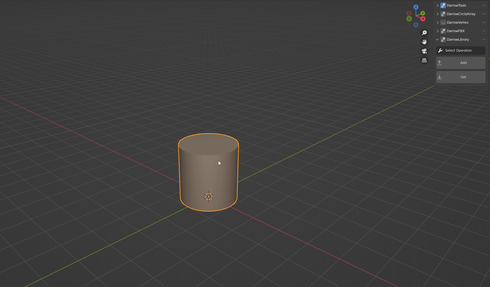

#####################
Introduction
#####################
DarrowToolkit contains many useful features to speed up the Blender pipeline. These are typically rather tedious/repetitive tasks that frustrated me enough to right a tool to speed them up. All the available operations should be contextual and limit user error. Aside from very few know bugs, this toollkit should be stable and ready to use by everyone. Including Blender 3.0+.

Features
--------------------
:ref:`qolTag` |
:ref:`vertexTag` |
:ref:`arrayTag` |
:ref:`fbxTag` |
:ref:`libraryTag` |

.. raw:: html

   
  

.. _qolTag:

Q.O.L Tools
++++++++++++

.. figure:: qol_Gif.gif
   :align: center

   *Multiple quality of life improvement operators*

Found in the sidebar, there are multiple quality of life improvement buttons to make certain tasks in blender combined and easier to find. Including:

1. Toggling only wireframe for the viewport

2. Set selected (any) as object origin
   
3. Move selected object back to world origin

4. Cleaning a mesh
   
5. Auto smooth object 

6. Apply all transformations

7. Recalculating normals outside

.. raw:: html
    
   
  

.. _vertexTag:

Vertex Masking
+++++++++++++++++++++++++++++++

.. figure:: Vertex_Gif.gif
   :align: center

   *Simple vertex masking*

The *DarrowVertex* tool is an easy to use and simple way to create RGB masks from selection. Simply:

1. Toggle vertex color visibility by clicking the eyeball in the sidebar panel.

2. Select any object(s), vertex, or face

3. Select the color to use on those faces

.. raw:: html
    
   
  

.. _arrayTag:

Circular Array
+++++++++++++++++++++

.. figure:: Array_Gif.gif
   :align: center

   *Simple array of a cylinder*

*DarrowCircleArray* will array the selected mesh around the cursor's current location. So how ever far away the selected mesh is, that is the radius of the circle used to array. This tool is non-destructive so the values can be changed on the fly. 

1. Select your object

2. Set the desired amount of array elements in the sidebar panel
   
3. Select an axis to array along (only one axis can be selected)

4. Hit "Array Selected"

*Too change the array amount, simply reselect the object, change the amount in the panel, and hit "Array Selected" again! This will also recalculate the positions of the arrayed object.*

.. warning:: When duplicating a mesh that has a "DarrowToolkitArray" modifier on it, the data will not always update accordingly. To fix this, either create a new mesh, or apply the modifier before duplicating.

.. raw:: html
    
   
  

.. _fbxTag:

FBX Exporter
++++++++++++++

.. figure:: Export_Gif.gif
   :align: center

   *Simple exporting of a cylinder with the object name as the file output*

Easy FBX Exporting for Blender with just a click. This tool allows you to not worry about settings or naming conventions, and simply hit export and forget about it. Using standard export options for both Unreal and Unity, this tools allows you to easily export your selected objects with the correct object name -- by default.

1. Select mesh

2. Hit "export selected"

3. Navigate to the destination folder

4. Hit enter, or "export selected" in the pop-up.

Don't worry about filling anything out in the pop-up menu, my tool will automatically use the name of your selected mesh.

*Prefix and suffix naming.*
Looking for different naming conventions? Try using the "Prefix" and "Suffix" options. These custom options include things like mesh export counting and custom prefix words, like "assets".

Models imported into Unity/Unreal will have correct orientations!  Animations "should" work, but additional animation settings will be available soon. If you encounter problems with exporting (animation included) please reach out and let me know. 

*For advanced options, toggle the cogwheel in the panel menu.*

.. note:: Please do not attempt to change the export name in the file browser. Whatever name you type in will be added to the output name on export, leaving you with an incorrect .fbx file name.

.. raw:: html
    
   
  

.. _libraryTag:

External Mesh Library
++++++++++++++++++++++

   *Adding and receiving a cylinder from the mesh library*

Managing you objects(currently mesh data only) has never been easier. With a click of the button, your mesh is stored in a local folder, for easy importing.

1. Select "Add"

2. Hit "Add to Library"

Don't worry, getting the mesh back into a blend scene is just as easy!

1. Select "Get"

2. Navigate the drop down panel titled "Get from library"

3. Select your desired mesh!

.. note:: To navigate to the thumbnail and object folders, hit the cogwheel in the panel, and select the corresponding button.

.. raw:: html
    
   
  

.. _downloadTag:

Downloads
-----------------------

Github
++++++++++++++++++++++

`Latest build available on Github`_.

.. _Latest build available on Github: https://github.com/BlakeDarrow/darrow_toolkit/releases

`Source available on Github`_.

.. _Source available on Github: https://github.com/BlakeDarrow/darrow_toolkit

Gumroad
++++++++++++++++++++++

`Also available on Gumroad`_.

.. _Also available on Gumroad: https://blakedarrow.gumroad.com/l/DarrowTools

.. raw:: html
    
   
  

Installation
--------------------
1. Download the latest zip file from the github release section.
2. Under addon preferences in Blender, click 'install' and the select the recently downloaded zip file.

.. note:: If you get an error when installing saying there isn't a module named "darrow_toolkit", restart Blender and try enabling the addon again.
